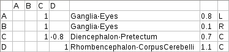
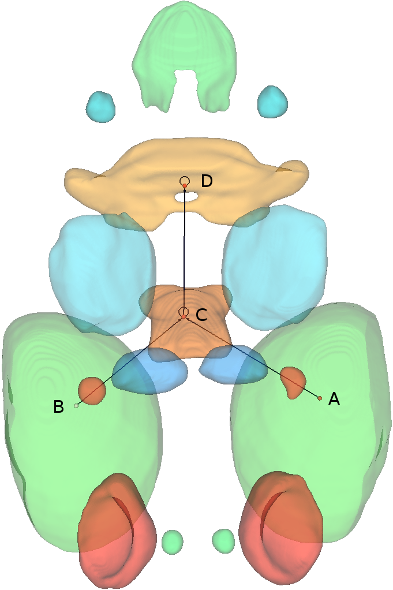
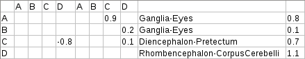
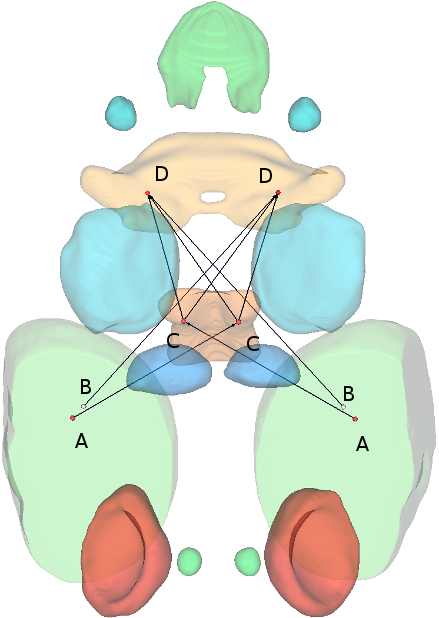

# File formats

## Project files

The project files are saved in ASCII XML format containing all project information and links to the mesh files associated with the project. The format is easy to understand - save a project and have a look at the file.

## Connectivity matrices

The matrices are saved in a CSV format. There are two types of connectivity matrices: symmetric and asymmetric. In the following, both are explained using simple examples.

### Asymmetric

Importing the matrix below will generate 4 neurons A, B, C and D. The first row and first column contain the neuron names. Enter a number in the 4x4 submatrix in order to connect the neuron at the corresponding row to the neuron at the corresponding column. Note that the connections are directed. The forelast column defines the brain regions the neurons should be placed in. The last column defines whether the neuron should be placed in the left (L), central (C) or right (R) part of the brain region.

### Symmetric

Importing the matrix below will generate 4 neuron pairs: one for each A, B, C and D. Each neuron pair consists of two neurons which will be placed symmetrically in the specified brain region as shown in the image. The left 4x4 sub-matrix defines the ipsilateral connections (connecting neurons on the same side of the brain). In this example, the C neurons are connected to the D neurons on the same side of the brain by a connection with strength of -0.8. The second 4x4 sub-matrix defines the contralateral connections (connecting neurons on opposite brain sides). The last column contains the threshold potential of each neuron (not used in the current software version).

