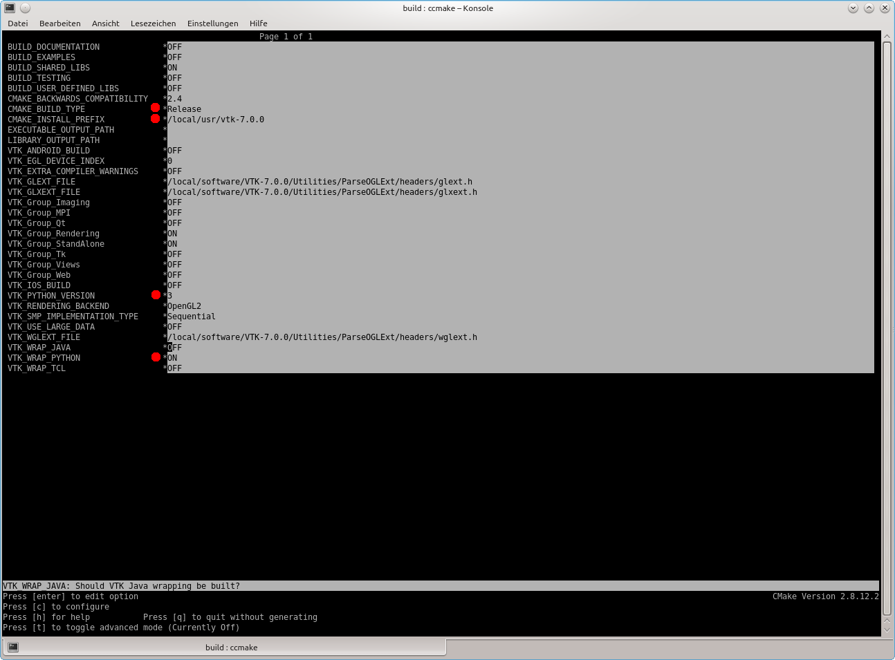

# Install VTK on Linux

We build VTK from source using CMake and g++.

* Install CMake by opening a console and running `sudo apt-get install cmake-curses-gui`.
* Download the latest stable VTK source code (at the time of writing it is 7.0.0) from http://www.vtk.org/download/.
* Unpack the file, enter the main directory and create a new folder (usually) called **build**.
* Open a console, navigate to **build** and type in `ccmake ..`
* Hit **c** on the keyboard (for configure) and wait until it's done.
* Set the entries marked by the red dots in the following screenshot to the shown values:

* Hit **c** again and when it's done hit **g** (for generate).
* In the console, type in `make`
* Type in `make install` (or `sudo make install`). This installs VTK in **/usr/local/vtk7**.
