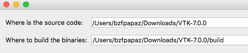
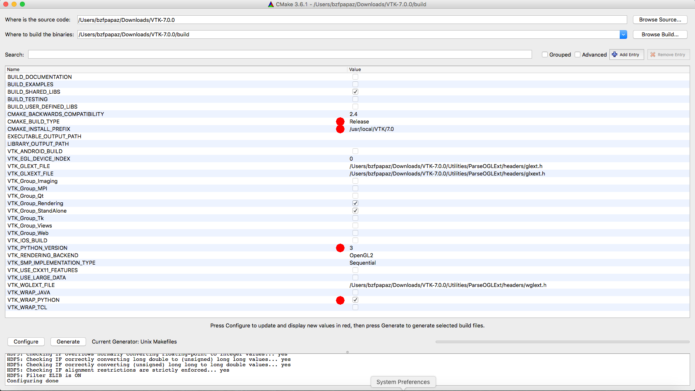
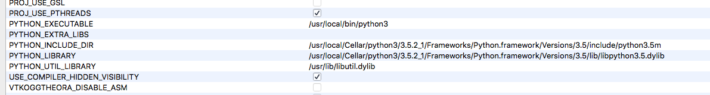

# Install VTK on OS X

We build VTK from source using CMake and g++.

* Install CMake.
* Download the latest stable VTK source code (at the time of writing it is 7.0.0) from http://www.vtk.org/download/.
* Unzip the file, enter the main directory (in our case, **VTK-7.0.0**) and create a new folder (usually) called **build**.
* Open CMake and fill in the first two lines as shown in the screenshot (you should change **/Users/bzfpapaz/Downloads** to the folder where you downloaded VTK):

* Hit **Configure** and wait until it is done. Change the blue marked entries as shown:

* Hit **Configure** again and when it is done click on the checkbox `Advanced` in the upper right part of CMake. Find the following four lines and set them as shown here:

  These values are based on the output of `python3-config --include`. You should run this command in a shell and adapt the CMake entries above according to the output. On our system `python3-config --include` gives `-I/usr/local/Cellar/python3/3.5.2_1/Frameworks/Python.framework/Versions/3.5/include/python3.5m`.

* Hit **Configure** again and when it's done hit **Generate**. Close CMake when the generating is done.
* Go to the **build** directory and run `make install` in a shell (or `sudo make install`).
* It takes a while to build VTK. At the end, it should be in **/usr/local/VTK/7.0**.
